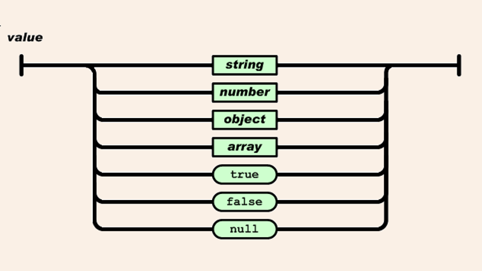
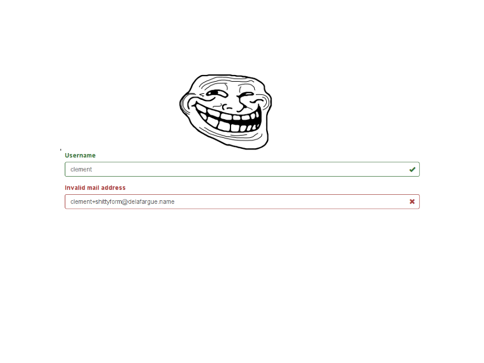
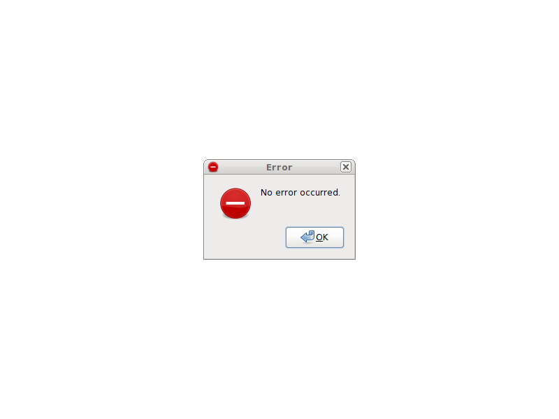
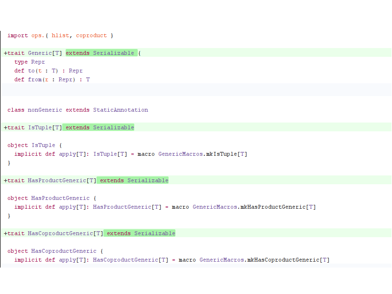
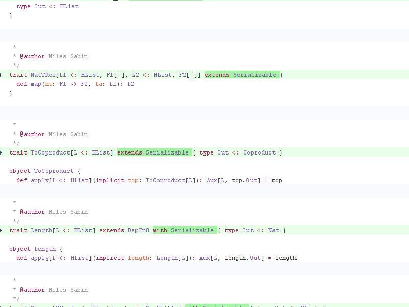

% Functional patterns for  Scala <span class="red">beginners</span>
% Clément Delafargue
% 2015-12-10

# I'm online!

 - [\@clementd](https://twitter.com/clementd) on twitter
 - [cltdl.fr/blog](http://cltdl.fr/blog)
 - [clever cloud](http://clever-cloud.com)

-------------------------------------------


-------------------------------------------

<p style="text-align:center">
<br><br>
<span style="font-size: 5.5em;">λ</span>
</p>

-------------------------------------------

<p style="text-align:center">
<br><br>
<span style="font-size: 5.5em;">Scala</span>
</p>

-------------------------------------------

<p style="text-align:center">
<br><br>
<span style="font-size: 5.5em;">JS</span>
</p>

-------------------------------------------

```haskell
zygoHistoPrepro 
  :: (Unfoldable t, Foldable t) 
  => (Base t b -> b) 
  -> (forall c. Base t c -> Base t c) 
  -> (Base t (EnvT b (Stream (Base t)) a) -> a) 
  -> t
  -> a
zygoHistoPrepro f g t =
  gprepro (distZygoT f distHisto) g t
-- unless you want
-- a generalized zygomorphism.
```

<details>
I won't talk about high level abstractions
but bases used to build upon
</details>

-------------------------------------------

# No swagoid yolomorphisms today

-------------------------------------------

# Tools they're built upon

-------------------------------------------


<video src="/home/clement/Images/lol/how-we-do.webm" loop></video>

<details>
Just examples, YMMV. Read code, find your own style.
You can go a lot farther than what I'll show, use more generic coding style.
`bête et méchant`
</details>

-------------------------------------------

# Object / FP

<video src="/home/clement/Images/lol/taylor-cat.webm" loop></video>

<details>
OO has plenty of beginner-oriented litterature. FP patterns in scala is a bit
less documented. It's often ported from haskell / other fp-centric languages
without ceremony.
</details>

-------------------------------------------

## Object / FP

<details>
I'll focus on patterns common in the FP world (not intrinsically FP, though).
Object-orientation will play a part, but more as implementation details than
design
</details>

-------------------------------------------

# What is FP?

<video src="/home/clement/Images/lol/mlp-what-is-love.webm" loop></video>

<details>
Many definitions
</details>

-------------------------------------------

# Programming with values

<video src="/home/clement/Images/lol/ice-cream-machine.webm" loop></video>

<details>
The control flow is data dependency
</details>

-------------------------------------------

# Expressions

-------------------------------------------

# Expressions

```scala
val x = if(yolo) {
  swag()
} else {
  moreRegularOutfit()
}
```

-------------------------------------------

# Expressions

```scala
val x = foo match {
    case Yolo(swag) => yoloSwag(swag)
    case NotYolo => notYoloSwag()
}
```

-------------------------------------------

## Typed FP

<details>
Since all the flow is data, you can get the type system to check your control
flow. Which is a good thing
</details>

-------------------------------------------

## Algebraic design

-------------------------------------------

## How do we model data?

-------------------------------------------

## Algebraic data types

-------------------------------------------

## Sum / Product

-------------------------------------------

## Product

<details>
Tuples, case classes
Cartesian product
</details>

-------------------------------------------

# Construction

```scala
val c = ("Clément", 26)

case class User(name: String, age: Int)
val cc = User("Clément", 26)
```

-------------------------------------------

# Elimination

```scala
val (name, age) = ("Clément", 26)

val User(name, age) = User("Clément", 26)
```

-------------------------------------------

# Product

```scala
// 2 * 2 = 4
(true, true)
(true, false)
(false, true)
(false, false)
```

-------------------------------------------


## Sum

<details>
Disjointed union
Closed
</details>

-------------------------------------------



-------------------------------------------

# In Haskell


```haskell
data JsonElem = JsonNull
              | JsonBoolean Bool
              | JsonString String
              | JsonNumber Double
              | JsonArray [JsonElem]
              | JsonObject (Map String JsonElem)
```

-------------------------------------------

## In Scala?

<details>
No direct syntactic support for disjoint unions, sealed
trait
</details>

-------------------------------------------

```scala
sealed trait JsonElem

case object JsonNull
  extends JsonElem
case class  JsonBoolean(v: Boolean)
  extends JsonElem
case class  JsonString(v: String)
  extends JsonElem
case class  JsonNumber(v: Double)
  extends JsonElem
case class  JsonArray(v: Seq[JsonElem])
  extends JsonElem
case class  JsonObject(v: Map[String, JsonElem])
  extends JsonElem
```


-------------------------------------------

```scala
def stringify(json: JsonValue) =
  jsonValue match {
    case JsonNull => "null"
    case JsonBoolean(v) => v.toString
    …
    case JsonArray(v) =>
      v.map(stringify(_))
       .mkString("[", ",", "]")
  }
```

-------------------------------------------

<small>

    <console>:9: warning: match may not be exhaustive.
    It would fail on the following input: JsonString
           def stringify(json: JsonValue) = json match {
                                            ^
    stringify: (json: JsonValue)String

</small>

<details>
Warning for non-exhaustive patterns
</details>

-------------------------------------------

## Scala niceties

-------------------------------------------

```scala
case class
  JsonArray(v: Seq[JsonElem])
  extends JsonElem with JsonValue

case class
  JsonObject(v: Map[String, JsonElem])
  extends JsonElem with JsonValue
```

<details>
Since it's not directly encoded in the language, we have more flexibility.
Use with caution
</details>

-------------------------------------------

## OOP: methods on classes

-------------------------------------------

## ADTs: pattern matching

-------------------------------------------

## OOP: easy to add cases

-------------------------------------------

## FP: easy to add functions

-------------------------------------------

## Hand rolled ADT or generic types?

<details>
Use your best judgment. Concision / type safety
</details>

-------------------------------------------

```scala
("Clément", 26)

User(name = "Clément", age = 26)
```

-------------------------------------------

```scala
val v: Either[String, Int] =
  Left("error")

sealed trait MyEither

case class MyLeft(v: String)
  extends MyEither

case class MyRight(v: Int)
  extends MyEither
```

-------------------------------------------

# Sum / Product <br><br> + / *

-------------------------------------------

# Fun equivalences

<div style="margin-top: 200px">
```
a*1 <=> a
a+0 <=> a
```
</div>

# Fun equivalences

<div style="margin-top: 200px">
```
(a*b)*c <=> a*(b*c) <=> a*b*c
(a+b)+c <=> a+(b+c) <=> a+b+c

a*(b+c) <=> (a*b)+(a*c)
x+x+…+x <=> n*x
```
</div>

# Fun equivalences

<div style="margin-top: 200px">
```
c^(a+b) <=> c^a * c^b
```
</div>

-------------------------------------------

## `(): Unit`

-------------------------------------------

## `void: Void`


-------------------------------------------

# `a*1 <=> a`

`(A,Unit) <=> A`

-------------------------------------------

# `a+0 <=> a`

`A | Void <=> A`

-------------------------------------------

### `(a*b)*c <=>` <br> `a*(b*c)`

-------------------------------------------

### `a*b*c`

-------------------------------------------

```scala
(("Clément", 26), "Éol")

("Clément", (26, "Éol))

("Clément", 26, "Éol")
```

<details>
Flatten tuples, case classes
</details>

-------------------------------------------

```scala
(User("Clément", 26), Pet("Éol"))


UserWithPet("Clément", 26, "Éol")
```

<details>
Flatten tuples, case classes
</details>

-------------------------------------------

### `(a+b)+c <=>`<br>`a+(b+c)`

-------------------------------------------

### `a+b+c`

-------------------------------------------

```scala
c match {
  case Left(a)         => "Left " + a
  case Right(Left(a))  => "Middle " + a
  case Right(Right(a)) => "Right " + a
}
```

<details>
Flatten unions
</details>

-------------------------------------------

```scala
c match {
  case Left(a)   => "Left " + a
  case Middle(a) => "Middle " + a
  case Right(a)  => "Right " + a
}
```

<details>
Flatten unions
</details>

-------------------------------------------

## `a*(b+c) <=> (a*b)+(a*c)`

-------------------------------------------

```scala
("X", Left("Y"))
("X", Right(42))

Left(("X", "Y"))
Right(("X", 42))

```

<details>
Factor out common properties
</details>

-------------------------------------------

# `x+x+…+x <=> n*x`

-------------------------------------------

```scala
sealed trait X
case class Bad(v: String) extends X
case class Good(v: String) extends X

case class Y(v: String, isGood: Bool)
```


<details>
Especially, factor out common properties and use an enum…
or do the converse
</details>


-------------------------------------------

## `c^(a+b) <=> c^a * c^b`

-------------------------------------------

## Case analysis


<details>
Case analysis: fold
</details>

-------------------------------------------

## By the way

-------------------------------------------

# Avoid booleans

-------------------------------------------

# Programming with <br><br>values

-------------------------------------------

# Programming with <span class="red">contextualized</span> values

-------------------------------------------

# Error handling

<video src="/home/clement/Images/lol/cat-waterballoon.webm" loop></video>

-------------------------------------------

# Option

-------------------------------------------

# Call it maybe

<video src="/home/clement/Images/lol/call-me-maybe.webm" loop></video>

-------------------------------------------

## Only one thing can go wrong

-------------------------------------------

# Either

-------------------------------------------

<video src="/home/clement/Images/lol/sharks.webm" loop></video>

-------------------------------------------

# Right contains the expected value

<video src="/home/clement/Images/lol/bear_hay.webm" loop></video>

-------------------------------------------

# Left contains the error

<video src="/home/clement/Images/lol/cat-box.webm" loop></video>

-------------------------------------------

## Use an ADT to describe the error

-------------------------------------------

# <small>`Either[String, A]`</small>

-------------------------------------------

<video src="/home/clement/Images/lol/cat-poop.webm" loop></video>

-------------------------------------------

```scala
sealed trait InputError

case class MissingUsername
  extends InputError

case class InvalidEmail
  extends InputError
```

-------------------------------------------

```scala
val a: Either[InputError, User] = ???

a match {
  case Right(user) => ???
  case Left(MissingUsername) => ???
  case Left(InvalidEmail) => ???
}
```

-------------------------------------------

# Either: not biased

```scala
for {
  a <- Right("operation 1 ok").right
  b <- Left("operation 2 failed").right
  c <- Left("operation 3 failed").right
} yield c
```

-------------------------------------------

# Either: not biased


    res8: scala.util.Either[String,String] =
      Left(operation 2 failed)

-------------------------------------------

# Inference issues

<div style="margin-top: 200px">
<small>
<small>
<small>
```scala
scala> Option("test").fold(Left("error"))(Right.apply)
<console>:10: error: polymorphic expression
                     cannot be instantiated to expected type;
 found   : [A, B](b: B)scala.util.Right[A,B]
 required: String => scala.util.Left[String,Nothing]
              Option("test").fold(Left("error"))(Right.apply)
```
</small>
</small>
</small>
</div>

-------------------------------------------

# Quirky

```scala
scala> Option("test").toRight("error")
res1:
  Product
  with Serializable
  with scala.util.Either[String,String] =
    Right(test)
```
-------------------------------------------

## Consider using scalaz.\\/

-------------------------------------------

# scalaz.\\/

```scala
for {
  a <- \/.right("ok")
  b <- \/.left("error 1")
  c <- \/.left("error 2")
} yield c
```

<details>Right-biased, more explicit, less subtyping issues</details>

-------------------------------------------

# scalaz.\\/

```scala
res16: scalaz.\/[String,String] =
    -\/(error 1)
```

-------------------------------------------

# Either and \\/ fail fast

<video src="/home/clement/Images/lol/plane-fail.webm" loop></video>


-------------------------------------------


-------------------------------------------


-------------------------------------------


-------------------------------------------



-------------------------------------------

## Error accumulation

<video src="/home/clement/Images/lol/stacking-fail.webm" loop></video>

-------------------------------------------

# Consider using scalaz.Validation

-------------------------------------------

# scalaz.Validation

<div style="margin-top: 200px">
```scala
def validateEmail(value: String):
  ValidationNel[String, String] = {

    value.successNel[String]
    // or
    "error".failNel[String]
}
```
</div>

-------------------------------------------

# NonEmptyList



-------------------------------------------

# scalaz.Validation

<div style="margin-top: 200px">
```scala
val user = (
  validateEmail(email) |@|
  validateUsername(username)) {
  case (e, u) =>

    User(e, u)
}
```
</div>

-------------------------------------------

# scalaz.Validation

```scala
    Success(User(email, username))
```

-------------------------------------------

# scalaz.Validation

```
    Failure(
      NonEmptyList(
        "invalid username"))
```

-------------------------------------------

# scalaz.Validation

```
    Failure(
      NonEmptyList(
        "invalid email",
        "invalid username"))
```

-------------------------------------------

## Don't always flatten your errors

-------------------------------------------

# Extensibility

<video src="/home/clement/Images/lol/octocat.webm" loop></video>

-------------------------------------------

## Ad-Hoc polymorphism

-------------------------------------------

## But a little less Ad-Hoc

-------------------------------------------

# Monoid example


-------------------------------------------

# Big Data™

<video src="/home/clement/Images/lol/cats-tube-simpsons.webm" loop></video>

<details>The only thing you need to know to become a big data expert</details>

-------------------------------------------

# Combine 2 values

(associatively)

-------------------------------------------

# Neutral element

(left & right identity)

-------------------------------------------

# First try

```scala
trait Monoid {
  def combine(o: Monoid): Monoid
}
```

-------------------------------------------

# First try

```scala
class MyClass extends Monoid {
  def combine(o: Monoid) = ???
}
```

-------------------------------------------

# Information Loss

-------------------------------------------

# Can't add behaviour to final classes

-------------------------------------------

# How to encode `zero`?

-------------------------------------------

# External declaration


# External declaration

-------------------------------------------

# Declare behaviour

```scala
trait Monoid[A] {
  def mzero: A
  def mappend(a: A, b: A): A
}
```

-------------------------------------------

## No problem with final types

-------------------------------------------

## No information loss

-------------------------------------------

# Implement it

```scala
val stringMonoid = new Monoid[String] {
  def mzero = ""
  def mappend(a: String, b: String) =
    a + b
}
```

-------------------------------------------

# Use it

```scala
def mconcat[A]
  (elems: Seq[A])
  (ev: Monoid[A]) = {

  elems.foldLeft(ev.mzero)(ev.mappend)

}
```

-------------------------------------------

```scala
mconcat(Seq("1", "2", "3"))(stringMonoid)
// "123"

mconcat(Seq(1, 2, 3, 4))(addIntMonoid)
// 10

mconcat(Seq(1, 2, 3, 4))(multIntMonoid)
// 24
```

-------------------------------------------

## Automatic wiring

-------------------------------------------

# Implement it

```scala
implicit val stringMonoid =
new Monoid[String] {
  def mzero = ""
  def mappend(a: String, b: String) =
    a + b
}
```

-------------------------------------------

# Use it

```scala
def mconcat[A]
  (elems: Seq[A])
  (implicit ev: Monoid[A]) = {

  elems.foldLeft(ev.mzero)(ev.mappend)

}
```

-------------------------------------------

# Use it

```scala
def mconcat[A: Monoid](elems: Seq[A]) = {
  val ev = implicitly[Monoid[A]]
  elems.foldLeft(ev.mzero)(ev.mappend)
}
```

-------------------------------------------

# Use it

```scala
mconcat(Seq("1", "2", "3"))
// "123"

mconcat(Seq(1, 2, 3))
// ???
```

-------------------------------------------

# Typeclass convergence

-------------------------------------------

```scala
import simulacrum._

@typeclass trait Semigroup[A] {
  @op("|+|") def append(x: A, y: A): A
}
```

-------------------------------------------

# Serialization

-------------------------------------------


-------------------------------------------



-------------------------------------------



-------------------------------------------

```scala
trait ToJson[A] {
  def toJson(v: A): JsonElem
}
```

-------------------------------------------

```scala
implicit def mapToJson[A: ToJson]() =
  new ToJson[Map[String, A]] {


  val ev = implicitly[ToJson[A]]

  def toJson(vs: Map[String, A]) =
  JsonObject(
    vs.mapValues(ev.toJson _)
  )
}
```

-------------------------------------------

## Central to Play!'s design

-------------------------------------------

## JSON

-------------------------------------------

## DB objects

-------------------------------------------

## QS parameters

-------------------------------------------

## Forms

-------------------------------------------

# Read cats code

<video src="/home/clement/Images/lol/twilight_reading.webm" loop></video>

-------------------------------------------

# Property-Based tests


-------------------------------------------

<p style="text-align: center">
<span style="font-size: 5.5em;">∃</span>
</p>

<p style="text-align: center">
« there exists »
</p>

<details>tests show the presence of bugs, not their absence</details>

-------------------------------------------

<p style="text-align: center">
<span style="font-size: 5.5em;">∀</span>
</p>

<p style="text-align: center">
« for all »
</p>

-------------------------------------------

## Scalacheck

-------------------------------------------


```scala
property("substring") =
  forAll { (
     a: String,
     b: String,
     c: String) =>
    (a+b+c)
     .substring(
      a.length,
      a.length+b.length) == b
  }
```

-------------------------------------------

# Separate effects from logic

<details>
Separate decision from interpretation
Keep a (mostly) pure core, push effects to the boundaries Effects described as
data structures can be test, acted upon, batched, sometimes reversed.
</details>

-------------------------------------------

### Encode effects description as an ADT

-------------------------------------------

```scala
case class AddUser(user: User)

case class TransferAmount(
  to: User,
  from: User,
  amount: Money)
```

-------------------------------------------

## Declare actions / effects

-------------------------------------------

# Interpret them "at the end of the world"

-------------------------------------------

<video src="/home/clement/Images/lol/but-why.webm" loop></video>

-------------------------------------------

## Testability

<details>
Test the output of the business logic code without having to actually exectute
the effects
</details>

-------------------------------------------

## Flexibility


<details>
Batch, deduplicate, compress. Persist the effects description directly to be
able to go back in time. Event sourcing's good, m'kay?
</details>

-------------------------------------------

# Go back in time

<video src="/home/clement/Images/lol/allons-y.webm" loop></video>

-------------------------------------------

## Recap

-------------------------------------------

## ADTs

-------------------------------------------

## Materialized errors

-------------------------------------------

## Typeclasses

-------------------------------------------

## Property-based testing

-------------------------------------------

## Segregated effects

-------------------------------------------

## Read FP in Scala

-------------------------------------------

## Thanks

-------------------------------------------

<video src="/home/clement/Images/lol/big_internet_hug.webm" loop></video>

-------------------------------------------

# Thanks

## <http://cltdl.fr/gifs>

-------------------------------------------

# <small><small>Give Clever Cloud a try!</small></small>


`scalaexchange`

-------------------------------------------
# I'm online!

- [\@clementd](https://twitter.com/clementd) on twitter
- [cltdl.fr/blog](http://cltdl.fr/blog)
- [clever cloud](http://clever-cloud.com)

