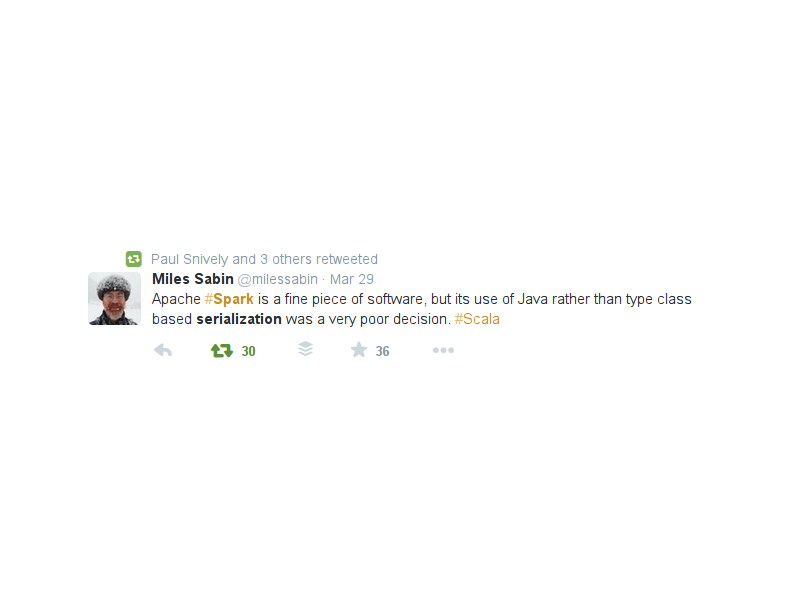

% Functional patterns for Scala <span class="red">beginners</span>
% Clément Delafargue
% flatMap(Oslo) 2015-04-28

# I'm online!

 - [\@clementd](https://twitter.com/clementd) on twitter
 - [cltdl.fr/blog](https://cltdl.fr/blog)
 - [clever cloud](http://clever-cloud.com)

-------------------------------------------


-------------------------------------------

<p style="text-align:center">
<br><br>
<span style="font-size: 5.5em;">λ</span>
</p>

-------------------------------------------

<p style="text-align:center">
<br><br>
<span style="font-size: 5.5em;">Scala</span>
</p>

-------------------------------------------

<p style="text-align:center">
<br><br>
<span style="font-size: 5.5em;">JS</span>
</p>

-------------------------------------------

```haskell
zygoHistoPrepro 
  :: (Unfoldable t, Foldable t) 
  => (Base t b -> b) 
  -> (forall c. Base t c -> Base t c) 
  -> (Base t (EnvT b (Stream (Base t)) a) -> a) 
  -> t
  -> a
zygoHistoPrepro f g t =
  gprepro (distZygoT f distHisto) g t
-- unless you want
-- a generalized zygomorphism.
```

<details>
I won't talk about high level abstractions
but bases used to build upon
</details>

-------------------------------------------

<video src="/home/clement/Images/lol/how-we-do.webm" loop></video>

<details>
Just examples, YMMV. Read code, find your own style.
You can go a lot farther than what I'll show, use more generic coding style.
`bête et méchant`
</details>

-------------------------------------------

# Object / FP

<video src="/home/clement/Images/lol/taylor-cat.webm" loop></video>

<details>
OO has plenty of beginner-oriented litterature. FP patterns in scala is a bit
less documented. It's often ported from haskell / other fp-centric languages
without ceremony.
</details>

-------------------------------------------

## Object / FP

<details>
I'll focus on patterns common in the FP world (not intrinsically FP, though).
Object-orientation will play a part, but more as implementation details than
design
</details>

-------------------------------------------

# What is FP?

<video src="/home/clement/Images/lol/mlp-what-is-love.webm" loop></video>

<details>
Many definitions
</details>

-------------------------------------------

## Programming with values

<details>
The control flow is data dependency
</details>

-------------------------------------------

## Typed FP

<details>
Since all the flow is data, you can get the type system to check your control
flow. Which is a good thing
</details>

-------------------------------------------

## Algebraic design

-------------------------------------------

## How do we model data?

-------------------------------------------

## Algebraic data types

-------------------------------------------

## Sum / Product

-------------------------------------------

## Product

<details>
Tuples, case classes
Cartesian product
</details>

-------------------------------------------

## Sum

<details>
Disjointed union
Closed
</details>

-------------------------------------------

# In Haskell

```haskell
data JsonElem = JsonNull
              | JsonBoolean Bool
              | JsonString String
              | JsonNumber Double
              | JsonArray [JsonElem]
              | JsonObject (Map String JsonElem)
```

-------------------------------------------

## In Scala?

<details>
No direct syntactic support for disjoint unions, sealed
trait
</details>

-------------------------------------------

```scala
sealed trait JsonElem

case object JsonNull
  extends JsonElem
case class  JsonBoolean(v: Boolean)
  extends JsonElem
case class  JsonString(v: String)
  extends JsonElem
case class  JsonNumber(v: Double)
  extends JsonElem
case class  JsonArray(v: Seq[JsonElem])
  extends JsonElem
case class  JsonObject(v: Map[String, JsonElem])
  extends JsonElem
```


-------------------------------------------

```scala
sealed trait JsonValue
sealed trait JsonElem

case object JsonNull extends JsonElem
case class  JsonBoolean(v: Boolean) extends JsonElem
case class  JsonString(v: String) extends JsonElem
case class  JsonNumber(v: Double) extends JsonElem
```

-------------------------------------------

```scala
case class  JsonArray(v: Seq[JsonElem])
  extends JsonElem with JsonValue

case class  JsonObject(v: Map[String, JsonElem])
  extends JsonElem with JsonValue
```

<details>
Since it's not directly encoded in the language, we have more flexibility.
Use with caution
</details>

-------------------------------------------

# Using ADTs

<div style="margin-top: 200px;">
```scala
def stringify(json: JsonValue) =
  jsonValue match {
    case JsonNull => "null"
    case JsonBoolean(v) => v.toString
    …
    case JsonArray(v) =>
      v.map(stringify(_))
       .mkString("[", ",", "]")
  }
```
</div>

-------------------------------------------

<small>

    <console>:9: warning: match may not be exhaustive.
    It would fail on the following input: JsonString
           def stringify(json: JsonValue) = json match {
                                            ^
    stringify: (json: JsonValue)String

</small>

<details>
Warning for non-exhaustive patterns
</details>

-------------------------------------------

## FP: easy to add functions

-------------------------------------------

## OOP: easy to add cases

-------------------------------------------

## Hand rolled ADT or generic types?

<details>
Use your best judgment. Concision / type safety
</details>

-------------------------------------------

# Fun equivalences

<div style="margin-top: 200px">
```
a*1 <=> a
a+0 <=> a

(a*b)*c <=> a*(b*c) <=> a*b*c
(a+b)+c <=> a+(b+c) <=> a+b+c

a*(b+c) <=> (a*b)+(a*c)
x+x+…+x <=> n*x

c^(a+b) <=> c^a * c^b
```
</div>

-------------------------------------------

## `(): Unit`

-------------------------------------------

## `void: Void`


-------------------------------------------

# `a*1 <=> a`

`(A,Unit) <=> A`

-------------------------------------------

# `a+0 <=> a`

`A | Void <=> A`

-------------------------------------------

### `(a*b)*c <=>` <br> `a*(b*c) <=>`<br>`a*b*c`

-------------------------------------------

#`((A,B),C) <=> (A,(B,C)) <=> (A,B,C)`

<details>
Flatten tuples, case classes
</details>

-------------------------------------------

### `(a+b)+c <=>`<br>`a+(b+c) <=>`<br>`a+b+c`

-------------------------------------------

# `(A|B) | C <=> A | (B|C) <=> A | B | C`

<details>
Flatten unions
</details>

-------------------------------------------

## `a*(b+c) <=> (a*b)+(a*c)`

-------------------------------------------

## `(A,(B|C)) <=> (A,B)|(A|C)`

<details>
Factor out common properties
</details>

-------------------------------------------

# `x+x+…+x <=> n*x`

<details>
Especially, factor out common properties and use an enum…
or do the converse
</details>


-------------------------------------------

## `c^(a+b) <=> c^a * c^b`

-------------------------------------------

###`(A|B) => C `<br>`<=>`<br>`(A=>C,B=>C)`

<details>
Case analysis: fold
</details>

-------------------------------------------

# Programming with values

-------------------------------------------

# Programming with <span class="red">contextualized</span> values

-------------------------------------------

# Error handling

<video src="/home/clement/Images/lol/cat-waterballoon.webm" loop></video>

-------------------------------------------

# Maybe

<video src="/home/clement/Images/lol/call-me-maybe.webm" loop></video>

-------------------------------------------

# Either

<video src="/home/clement/Images/lol/sharks.webm" loop></video>

-------------------------------------------

# Left contains the error

-------------------------------------------

# Right contains the expected value

-------------------------------------------

# Consider using scalaz.\\/

-------------------------------------------

# Consider using scalaz.\\/

<details>Right-biased, more explicit</details>

-------------------------------------------

# Either and \\/ fail fast

-------------------------------------------

# Error accumulation

-------------------------------------------

# Consider using scalaz.Validation

-------------------------------------------


# Extensibility

-------------------------------------------

# Ad-Hoc polymorphism

-------------------------------------------

# But a little less Ad-Hoc

-------------------------------------------

# Monoid example

<details>The only thing you need to know to become a big data expert</details>

-------------------------------------------

# Types

```scala
trait Monoid[A] {
  def mzero: A
  def mappend(a: A, b: A): A
}
```

-------------------------------------------

# Laws

 - associativity
 - left & right identity

-------------------------------------------

# Instances

```scala
implicit val intMonoid = new Monoid[String] {
  def mzero = ""
  def mappend(a: String, b: String) = a + b
}
```

-------------------------------------------

# Use

```scala
def mconcat[A](elems: Seq[A])(implicit ev: Monoid[A]) = {
  elems.foldLeft(ev.mzero)(ev.mappend _)
}
```

-------------------------------------------

# Use

```scala
def mconcat[A: Monoid](elems: Seq[A]) = {
  val ev = implicitly[Monoid[A]]
  elems.foldLeft(ev.mzero)(ev.mappend _)
}
```

-------------------------------------------

# Read scalaz code

-------------------------------------------

# Property-Based tests

-------------------------------------------

# Laws / Discipline


-------------------------------------------




-------------------------------------------


-------------------------------------------


-------------------------------------------

```scala
trait ToJson[A] {
  def toJson(v: A): JsonElem
}
```

-------------------------------------------

```scala
implicit def mapToJson[A](implicit ev: ToJson[A]) = new ToJson[Map[String, A]] {
  def toJson(vs: Map[String, A]) = JsonObject(
    vs.mapValues(ev.toJson _)
  )
}
```

-------------------------------------------

# Separate effects from logic

Separate decision from interpretation

-------------------------------------------

# Separate effects from logic

Keep a (mostly) pure core, push effects to the boundaries Effects described as
data structures can be test, acted upon, batched, sometimes reversed.

-------------------------------------------


# Thanks

<video src="/home/clement/Images/lol/axolotl.webm" loop></video>

# Thanks

<http://cltdl.fr/gifs>

-------------------------------------------
# I'm online!

    - [\@clementd](https://twitter.com/clementd) on twitter
    - [cltdl.fr/blog](https://cltdl.fr/blog)
    - [clever cloud](http://clever-cloud.com)

