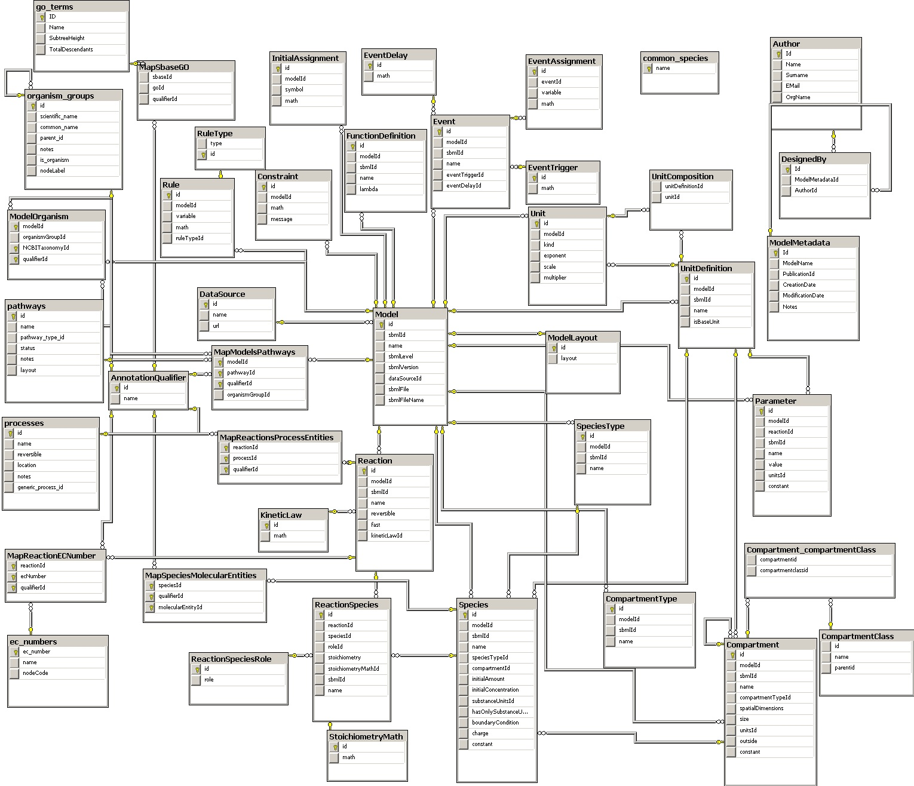

% Tips and Tricks for Clean RDB Schemas
% Clément Delafargue
% MixIT 2015-04-16

# I'm online!

 - [\@clementd](https://twitter.com/clementd) on twitter
 - [cltdl.fr/blog](https://cltdl.fr/blog)
 - [clever cloud](http://clever-cloud.com)

-------------------------------------------


-------------------------------------------

<p style="text-align:center">
<br><br>
<span style="font-size: 5.5em;">λ</span>
</p>

-------------------------------------------

<p style="text-align:center">
<br><br>
<span style="font-size: 5.5em;">Scala</span>
</p>

-------------------------------------------

<p style="text-align:center">
<br><br>
<span style="font-size: 5.5em;">JS</span>
</p>

-------------------------------------------

<p style="font-size: 2.2em; width: 50%; float: left;">
Mongo<br>
Riak<br>
Riak2<br>
Redis<br>
Couchbase<br>
CouchDB<br>
ElasticSearch
</p>
<p style="font-size: 2.2em;">
Titan<br>
Cassandra<br>
Kafka<br>
Hbase<br>
Neo4J<br>
Datomic<br>
</p>


<details>
I've played with lots of NoSQL dbs over the years
</details>

-------------------------------------------

<p style="text-align:center">
<br><br>
<span style="font-size: 4em;">Postgres</span>
</p>

<details>
  But most of my work is done with postgres nowadays
</details>

-------------------------------------------

## Why bother with SQL?

<details>
  Too complex, not flexible enough
</details>

-------------------------------------------

<p style="text-align:center">
<br><br>
<span style="font-size: 4em;">relational <span class="red">algebra</span></span>
</p>

<details>
  Very well defined mathematical foundations. Clear, rigorous design
</details>

-------------------------------------------

<p style="text-align:center">
<br><br>
<span style="font-size: 4em;">relational <span class="red">thinking</span></span>
</p>

<details>
  Very natural way to think
</details>

-------------------------------------------

<p style="text-align:center">
<br><br>
<span style="font-size: 3em;">Data consistency</span>
</p>

<details>
  Strong guarantees regarding the validity and the consistency of stored data
</details>

-------------------------------------------

# Exploratory queries

<video src="http://clementd-files.cellar-c1.clvrcld.net/lol/where-are-you.webm" loop></video>

<details>
  Very easy to mix and match data. Data can be used in unforeseen ways due to good composability
</details>


-------------------------------------------

# Reliance on the data model

<video src="http://clementd-files.cellar-c1.clvrcld.net/lol/trust-fall.webm" loop></video>

<details>
  All of this works only if you have a properly designed schema
</details>

-------------------------------------------
 
# Pay attention to your schema


<details>
  using a RDBMS without paying attention to the db schema is foolish. If you want an unstructured object dump,
  use document / graph stores
</details>

------------------------------------------

## Write your schema <span class="red">yourself</span>

<details>
  Your apps and your DB are 2 separate bricks, with an untyped boundary. Acknowledge this, don't try to hide it.
</details>

# Don't let a <span class="red">program</span> design your schema 

<video src="http://clementd-files.cellar-c1.clvrcld.net/lol/robot-door.webm" loop></video>

<details>
  The DB schema is central to your architecture. Handle it yourself
</details>

# Avoid ORMs

<video src="http://clementd-files.cellar-c1.clvrcld.net/lol/rube-goldberg.webm" loop></video>

<details>
  ORMs may be useful in certain, very specific cases, often related to operational concerns,
  not design-related. When it's design related, maybe a document store would be better.
</details>


# DB-agnosticism

<video src="http://clementd-files.cellar-c1.clvrcld.net/lol/trap.webm" loop></video>

<details>
  If you're not using db-specific features, you may not need a rdbms at all
</details>


# Use postgreSQL

<video src="http://clementd-files.cellar-c1.clvrcld.net/lol/elephant-jump.webm" loop></video>

<details>
  If you want to use open source stuff
</details>


-------------------------------------------

<video src="assets/video.mov" loop></video>

-------------------------------------------

# Avoid ORMs
<video src="http://clementd-files.cellar-c1.clvrcld.net/lol/rube-goldberg.webm" loop></video>

-------------------------------------------

## But <span class="red">please</span> use data mapping libraries

# POMM

<div style="margin-top: 200px">
```php
$where =
\Pomm\Query\Where::create(
  'birth_date >= $*',
  [ new \DateTime('1994-01-01') ])
->andWhere('gender = $*', ['M']);

$students =
  $student_model
  ->findWhere($where);
```
</div>  

# Anorm 

<div style="margin-top: 200px">
```scala
  SQL("""select student.student_id,
           student.name,
           student.birth_date""")
    .as((
      get[UUID]("student_id") ~
      str("name") ~
      get[DateTime]("birth_date")
    )).*)
```
</div>

# Anorm ( + PG entities)

```scala
  SQL(selectSQL[Student])
    .as(parser[Student].*)
```

-------------------------------------------

## (I wrote it)

-------------------------------------------

## (it's a cool lib)

# JOOQ

<div style="margin-top: 200px">
```java
Result<Record3<String, String, String>> result =
create.select(BOOK.TITLE, AUTHOR.FIRST_NAME, AUTHOR.LAST_NAME)
      .from(BOOK)
      .join(AUTHOR)
      .on(BOOK.AUTHOR_ID.equal(AUTHOR.ID))
      .where(BOOK.PUBLISHED_IN.equal(1948))
      .fetch();
```
</div>

-------------------------------------------

# DRY =!> ORM

<video src="http://clementd-files.cellar-c1.clvrcld.net/lol/cat-waterballoon.webm" loop></video>

<details>
  You can stay dry without an ORM.
</details>

-------------------------------------------

# Keep in control of the fetching depth

<video src="http://clementd-files.cellar-c1.clvrcld.net/lol/abyss.webm" loop></video>

<details>
  With lazy loading, you can have complex queries automatically performed without joins.
  The query depend on the code in your templates. Is your frontend dev knowledgable in DBs ?
</details>

-------------------------------------------

## Model your data with flat records

<details>
  Models representing the DB fields
</details>

-------------------------------------------

## Make joins explicit

<details>
  Composite objects representing joins
</details>

-------------------------------------------

## Now let's design great schemas

-------------------------------------------

## Entities

<details>
  Roughly corresponds to objects
</details>

-------------------------------------------

## Relations

<details>
  Relations between entities
</details>

-------------------------------------------

# Normal Forms


-------------------------------------------

# 1NF

    The key

<details>
  Homogeneous fields. Some fields are key fields
</details>

# 2NF

    The whole key

<details>
  All the non-key fields depend on all the key fields. If a field depends only
  on a part of the key field then there is a need for a 2nd entity
</details>


# 3NF

    Nothing but the key

<details>
  A non-key field cannot depend on another non-key field
</details>

# Boyce Codd NF

    So help me Codd

<details>
  A bit stronger than 3FN: forbids redundency caused by functional dependencies
</details>

-------------------------------------------

## That's all well and good

-------------------------------------------

## Let's get practical

-------------------------------------------

# Design with Querying in mind


-------------------------------------------

### Composite entities <span class="red">can</span> be good

-------------------------------------------

# Split data with Querying in mind

<video src="http://clementd-files.cellar-c1.clvrcld.net/lol/gun-logs.webm" loop></video>

-------------------------------------------

## Consistent naming

-------------------------------------------

## Singular table names

-------------------------------------------

**Uniform naming for PKs & FKs**


    <table_name>_id

-------------------------------------------

**Uniform naming for PKs & FKs**

```sqlpostgresql
select <fields> from
  table_1
  inner join table_2
    on table_1.table_1_id =
       table_2.table_2_id
```

-------------------------------------------

**Uniform naming for PKs & FKs**

```sqlpostgresql
select <fields> from
  table_1
  inner join table_2
    using (table_1_id)
```
-------------------------------------------

**Uniform naming for PKs & FKs**

```sqlpostgresql
select <fields> from
  table_1
  natural join table_2
```

-------------------------------------------

## Primary Keys

-------------------------------------------

## Use them

-------------------------------------------

## (I shouldn't even have to say that)

-------------------------------------------

#Use UUIDs

(or random IDs)

# Prevent entity enumeration
<video src="http://clementd-files.cellar-c1.clvrcld.net/lol/hacking.webm" loop></video>

# Prevent growth rate disclosure
<video src="http://clementd-files.cellar-c1.clvrcld.net/lol/hacking.webm" loop></video>

# Avoid linking the wrong table
<video src="http://clementd-files.cellar-c1.clvrcld.net/lol/table-flip.webm" loop></video>


# Default to not null


# Don't fear the join
<video src="http://clementd-files.cellar-c1.clvrcld.net/lol/elephants.webm" loop></video>

# Avoid deletions
<video src="http://clementd-files.cellar-c1.clvrcld.net/lol/delete.webm" loop></video>

# Avoid deletions

```sqlpostgresql
created_at
    timestamp with time zone not null,
deleted_at
    timestamp with time zone
```

-------------------------------------------

### Don't let <span class="red">invalid</span> states be <span class="red">representable</span>

-------------------------------------------

## Use rich types

-------------------------------------------

## Use <span class="red">precise</span> types

-------------------------------------------

# No more integers used as flags

<video src="http://clementd-files.cellar-c1.clvrcld.net/lol/lana-nope.webm" loop></video>

-------------------------------------------

##  4,294,967,295

-------------------------------------------

**Use enums**

```sqlpostgresql
create type status
as enum('pending', 'validated');
```

-------------------------------------------

**Use enums even when a boolean could do**

```sqlpostgresql
create type status
as enum('pending', 'validated');
```


-------------------------------------------

## Do that in your code too

-------------------------------------------

## Boolean Blindness

-------------------------------------------

## Use precise types

-------------------------------------------

## How do you store IP addresses?

-------------------------------------------

## Moot

-------------------------------------------

**Use precise types**

    inet (IP address)
    timestamp with time zone
    point (2D point)
    tstzrange (time range)
    interval (duration)

-------------------------------------------

**Create your own**

```sqlpostgresql
    create type my type
    as (
        field1 int,
        field2 text
    );
```

-------------------------------------------

## Use constraints when types are not enough

-------------------------------------------

**Rich types => powerful constraints**

```sqlpostgresql
create table reservation(
    reservation_id uuid primary key,
    dates tstzrange not null,
    exclude using gist (dates with &&)
);

```

-------------------------------------------

**Use arrays**

```sqlpostgresql
    select '{1,2,3}'::int[]
```

# You can dump K/V data
<video src="http://clementd-files.cellar-c1.clvrcld.net/lol/shape-toy.webm" loop></video>

# Hstore

```sqlpostgresql
SELECT 'a=>1,a=>2'::hstore;
  hstore
----------
 "a"=>"1"
```

# You can dump JSON data
<video src="http://clementd-files.cellar-c1.clvrcld.net/lol/shape-toy.webm" loop></video>

# Json / Jsonb

```sqlpostgresql
SELECT ('{ "a": "b"}'::jsonb)->>'a' as field;
  field
----------
 "b"
```

# jsonb

 - binary json
 - indexable
 - performant


# Structure your results 

# `array_agg`

```sqlpostgresql
select
  article.*,
  array_agg(comment.*) as comments
from
  article
  left join comment using(article_id)
```

# C2C Json

```sqlpostgresql
select
  row_to_json(article.*) as article,
  row_to_json(author.*) as author
from
  article
  inner join author using(author_id)
```

-------------------------------------------

# C2C Json

<div style="margin-top: 200px">
```sqlpostgresql
select
  row_to_json(article.*) as article,
  array_to_json(
    array_agg(
      row_to_json(comment.*))) as comments
from
  article
  inner join author using(author_id)
```
</div>

-------------------------------------------

**Common Table Expressions**

```sqlpostgresql
with sub_request as (
    select <fields> from table1
)

select <fields> from sub_request;
```

-------------------------------------------

**Window functions**

```sqlpostgresql
```

# Shameless plug
<video src="http://clementd-files.cellar-c1.clvrcld.net/lol/austin-omg.webm" loop></video>


# jDbT

<https://github.com/divarvel/jdbt>

-------------------------------------------

**jDbT**

```yaml
status:
  - Test
  - Prod

member:
  name: text
  email: text
  status: status | 'Test'
  __unique: [ name, email ]
```

-------------------------------------------

**jDbT**

```yaml
post:
  member_id:
  +?title: text
  ?content: text

tag:
    +name: text
    __check: name <> 'forbidden'
```

-------------------------------------------

**jDbT**

```yaml
post_tag:
    post_id:
    tag_id:
    __pk: [ tag_id, post_id ]
```

-------------------------------------------

**jDbT**


# jDbT

<http://jdbt-api.cleverapps.io>

-------------------------------------------

## So

-------------------------------------------

## Acknowledge the app / DB boundary

<details>
  The boundary is there, trying to hide it will only result in strange shit happening at runtime
</details>

-------------------------------------------

## Design your schema

<details>
  It's central to your overall design 
</details>

-------------------------------------------

## … with <span class="red">querying</span> in mind

<details>
  Your database is only there to be queried, don't overthink stuff that's not needed.
</details>

-------------------------------------------

## (avoid ORMs)

<details>
  I don't say it out loud bc I'm always afraid of being thrown out
  with tar and feathers.
  Depends on what is an ORM to you
</details>

-------------------------------------------

## Use precise types

<details>
  PostgreSQL provides wonderful types and is extensible.
</details>

-------------------------------------------

## Denormalize responsibly

<details>
  you can have nested instances, as long as you always access the child instance through its parent, that's ok
</details>

# Thanks

<video src="http://clementd-files.cellar-c1.clvrcld.net/lol/axolotl.webm" loop></video>

# Thanks

<http://cltdl.fr/gifs>

-------------------------------------------
# I'm online!

 - [\@clementd](https://twitter.com/clementd) on twitter
 - [cltdl.fr/blog](https://cltdl.fr/blog)
 - [clever cloud](http://clever-cloud.com)

